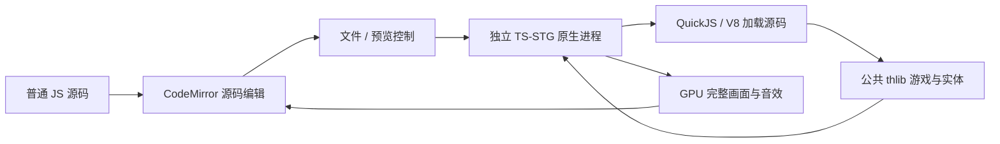

# SpellCardEditor

Windows 独立桌面 JS 符卡编辑与预览工具。左侧编写普通 `.spell.js`，右侧显示 TS-STG 原生引擎的完整画面与音效。源码是唯一编辑对象：没有事件列表、属性编排、坐标拖拽、事件时间轴或可视化回写，也不要求任何受管理的源码标记。

编辑器只负责文件、代码编辑和调试控制。弹幕、激光、自机、Bomb、碰撞、符卡演出、扭曲和 HUD 均由公共 thlib 在实际原生引擎中执行。预览 Boss 使用普通敌机占位，背景为坐标网格；具体 Boss 美术、关卡背景、对白和 BGM 由游戏业务层提供。

## 启动与操作

先完成 `build.ps1` 构建并导入公共素材，然后运行根目录 `start-spellcard-editor.cmd`。启动脚本会补齐编辑器依赖，构建本地代码编辑组件，并打开桌面窗口。也可手动运行：

```powershell
npm ci --prefix tools/spellcard-editor
npm --prefix tools/spellcard-editor run setup
npm --prefix tools/spellcard-editor start
```

启动时也可以直接传入一个 `.js` 或 `.mjs` 路径。例如，在仓库根目录的命令提示符中打开纸鹤符卡：

```bat
start-spellcard-editor.cmd "examples\spellcard\moonfold.spell.js"
```

PowerShell 中将启动脚本写成 `.\start-spellcard-editor.cmd`。也可通过 npm 明确指定文件：

```powershell
npm --prefix tools/spellcard-editor start -- --file "D:\AIWorkspace\TS-STG\examples\spellcard\moonfold.spell.js"
```

位置参数与 `--file <路径>` 都只接受一个文件；包含空格或中文的路径应加引号。相对路径按发起启动的目录解析，不按编辑器内部目录解析。路径以短横线开头时，可在它前面放置 `--`，例如 `npm --prefix tools/spellcard-editor start -- -- "-my-spell.js"`。省略路径时恢复现有 JS 草稿；指定文件与界面“打开”使用同样的文件校验。

CodeMirror 6 随工具在本地构建，提供 JavaScript 语法高亮、行号、折叠、括号匹配、缩进、撤销/重做和查找替换。运行时不依赖在线编辑器或 CDN。左右面板之间的分隔条可以拖动。

| 操作 | 用途 |
| --- | --- |
| 新建 / 打开 / 保存 / 另存 | 编辑 `.spell.js` 或 `.mjs`；新建提供可直接运行的 JS 示例 |
| 自动预览 | 停止输入约 450 ms 后应用源码；可以关闭 |
| Ctrl+Enter | 立即应用当前源码 |
| Ctrl+S / Ctrl+Shift+S | 保存 / 另存源码 |
| Ctrl+F / Ctrl+H | 查找 / 替换 |
| 播放 / 暂停 / 逐帧 | 控制真实预览的固定逻辑帧 |
| 回到开头 / 进度滑块 | 从同一种子重新模拟到指定帧 |
| 点击预览画面 | 方向键移动，Z 射击，X Bomb，Shift 低速；失焦自动释放按键 |

源码修改后，预览重建到原来的帧位置，原先正在播放则继续播放。新建或打开文件从第 0 帧开始。进度滑块是播放控制，不参与修改 JS。跳转使用初始自机位置和零输入，不重播此前手动试玩的按键。

预览提供无敌试玩。击破或时间结束后，继续更新公共消弹、结算提示与动画尾部，再停在结果画面。重新按下 Enter 或点击播放可从头试玩；一直按住 Enter 不会反复重开。暂停和跳转停止当前声音，跳转过程静音。

草稿保存完整源码，可跨次启动恢复；草稿不等于已写入用户选择的文件。无法编译的 JS 仍可以保存和恢复。文件入口只接受 `.js` 和 `.mjs`，不读取或转换旧的事件 JSON 文档。已有 JS 中的注释由作者保留，编辑器不会读取其中的旧标记或回写代码。

## 错误与预览状态

编辑器显示原生运行时的错误消息及堆栈，并在能够定位当前文件时标记出错行、支持跳转。源码已经继续修改时，旧版本的错误不会当作新版本诊断。

- 语法或模块构造失败：保留上一份有效场景，暂停并报告错误。
- 运行中出错：暂停在出错处；修正源码后重载。
- 原生预览进程退出：保留源码与最后画面，再次运行可重建预览。

源码具有原生脚本后端提供的能力，属于用户项目代码。预览执行普通 JS；编辑器不承诺静态证明脚本行为，也不将任意代码转成事件图。自动预览会重新执行模块初始化逻辑。

## 符卡模块

模块导出 `spellCard` 元数据与 `createSpell(context)`。元数据仅包含 `id/name/duration/hp/seed/boss`，由编辑器自己的预览适配器在原生运行时执行后校验，可以使用表达式、变量或函数；编辑器界面只展示求值后的名称和时长，不解析源码中的配置。这是预览工具的接入约定，thlib 不定义编辑器文档格式。

```js
export const spellCard = {
  id: 'my-spell', name: '螺旋环',
  duration: 60 * 30, hp: 3000, seed: 1,
  boss: {x: 0, y: 96},
};

export function createSpell(context) {
  let frame = 0;
  let alive = true;
  return {
    get frame() { return frame; },
    get alive() { return alive; },
    update() {
      if (!alive) return;
      if (frame % 12 === 0) {
        context.bullets.emit({
          x: context.boss.x, y: context.boss.y,
          type: 0, color: 6, pattern: 3,
          count: 12, rows: 1, speed: 2,
          angle: frame * 0.02,
        });
      }
      frame++;
      if (frame >= spellCard.duration) alive = false;
    },
    stop() { alive = false; },
  };
}
```

`createSpell(context)` 是必需的入口，直接用 JS 发弹、移动、聚能和组织状态。没有事件列表、事件解释器或缺省的攻击逻辑。已有手写 JS 若仍带旧元数据字段，应删除 `format`、`version`、`events`；曾经依赖事件 JSON 的攻击需改写为普通 JS。编辑器不会自动改写用户保存的文件。

运行器必须有 `frame`、`alive`、同步 `update()` 和 `stop()`，`snapshot()` 可选。逻辑帧固定 60 Hz；存活时每次 `update()` 将 `frame` 增加 1，也可以在当前帧停止。禁止异步更新，否则暂停和重新模拟无法可靠定位。世界坐标 x 为 -192..192、y 为 0..448，角度为弧度。

预览提供的 `context` 包含：

| 成员 | 公共能力 |
| --- | --- |
| `game` / `boss` / `player` | 当前游戏、自机与预览 Boss |
| `bullets` / `lasers` | 公共弹幕池与激光池 |
| `presentation` | 公共 Boss 演出 |
| `sound(id, x)` | 请求公共音效 |
| `clear()` | 预览消弹策略 |
| `random` | 由符卡种子创建的 `TouhouRNG`，提供 `unit()`、`signedUnit()`、`next()` |

游戏仍负责更新弹幕、激光、碰撞与演出实体，脚本不要重复更新它们。弹幕随机行为使用有种子的随机源；墙上时钟或 `Math.random()` 会破坏从同一位置重新模拟的一致性。可变运行状态应放在 `createSpell(context)` 内部，重启或跳转时创建新实例；模块级可变状态不会随实例重建而自动清零。

## 在游戏中使用

保存的文件是普通 ES 模块。使用方导入 `spellCard` 与 `createSpell`，在自己的阶段中创建 Boss、开启符卡、传入公共对象，并每逻辑帧调用一次运行器：

```js
import {spellCard as card, createSpell} from './spells/my-spell.spell.js';
import {TouhouRNG} from '@ts-stg/thlib/touhou';

const spell = createSpell({
  game, boss, player: game.player,
  bullets: game.bullets, lasers: game.lasers,
  presentation: game.bossPresentation,
  random: new TouhouRNG(card.seed), sound: game.context.sound,
  clear: cancelCurrentPhaseBullets,
});
// 当前阶段每逻辑帧调用：spell.update();
// 提前结束或离开阶段时：spell.stop();
```

结算、掉落、下一阶段、爆炸、退场或继续对话由使用方游戏流程决定。编辑器预览的单张符卡收尾不改变 thlib 的可组合机制。使用方无需安装 Electron、CodeMirror 或任何编辑器代码。

## 分层与范围



Electron 页面关闭 Node 集成，启用上下文隔离与沙箱。页面和主进程只传输、保存源码，不执行用户 JS；用户模块由独立原生进程加载。桌面窗口关闭时只清理自身预览进程。本地 HTTP 服务仅提供明确允许的界面文件，没有用于执行脚本的 HTTP 接口。

预览保留 60 Hz 固定逻辑帧，每两个渲染帧输出一幅 960×720 RGBA 画面，正常约 30 Hz 显示。Electron 只显示最终像素，不重新绘制游戏实体。最多一帧等待界面确认，繁忙时丢弃后续显示帧以免积压。GPU 读回和进程间复制带来额外成本，编辑器预览不用于衡量独立游戏性能。协议见 [原生宿主 API](native-api.md#windows-local-frame-stream)。

符卡名在编辑器预览中选择现有文字适配器的 `codePage: 936`；thlib 的日文默认值不变。结算耗时使用模拟时钟，暂停长度不会改变同一逻辑帧结果。

当前以单个源码模块和公共 thlib 导入为单位。模块写入临时预览工程后加载，暂不支持相对原文件目录的多文件工程、资源管理和外部 IDE 文件监听，也未提供完整的类型语言服务或断点调试。QuickJS 与 V8 可以执行同一模块；桌面内嵌预览目前仅支持 Windows。

发布范围仍是底层引擎和 thlib。编辑器、CodeMirror、Electron、预览适配器、元数据校验和临时文件不在默认 SDK 内。thlib 提供公共游戏实体与机制；作者用普通 JS 编写攻击，游戏负责调度及阶段收尾。

## 复现验证

```powershell
npm --prefix tools/spellcard-editor run build
node --test tests/spellcard-editor-*.test.js
node tools/verify-spellcard-editor.mjs
tools/spellcard-editor/node_modules/electron/dist/electron.exe tools/spellcard-editor --self-test
```

验证覆盖源码模板、文件服务边界、原生控制、QuickJS/V8 模块加载、手写 JS 发弹、确定性跳转及错误恢复。桌面验证使用真实代码组件、文件 IPC 与原生画面，只有系统文件选择器的返回值被替换；验证源码编辑、保存/打开、自动/手动预览、播放、暂停、逐帧、键盘输入及进程重建。

界面截图与验证结果写入 `reports/spellcard-editor/`，只截取编辑器自己的页面。测试结束后关闭测试窗口及其预览进程。
