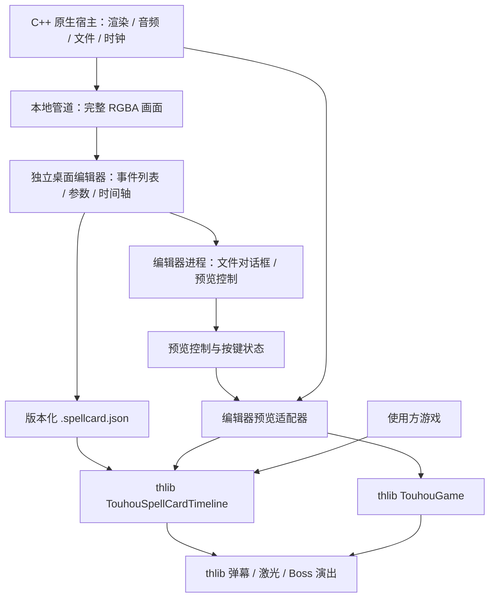

# SpellCardEditor

Windows 独立桌面符卡编辑器，中心显示实际 TS-STG 原生引擎的完整渲染画面。引擎在独立进程中运行，将 GPU 渲染后的 960×720 RGBA 画面送入编辑器；预览使用公共 `TouhouGame`、灵梦、自机武器、Bomb、弹幕、激光、聚能、符卡展开、扭曲和 HUD。Boss 使用普通敌机占位，背景为坐标网格；具体 Boss 美术、关卡背景、对白和 BGM 仍由游戏业务层提供。

## 启动与操作

先完成 `build.ps1` 构建并导入公共素材，然后运行根目录 `start-spellcard-editor.cmd`。首次启动安装编辑器自己的 Electron 依赖与桌面运行时；依赖锁定在 `tools/spellcard-editor/package-lock.json`。也可手动运行：

```powershell
npm install --prefix tools/spellcard-editor
npm --prefix tools/spellcard-editor run setup
npm --prefix tools/spellcard-editor start
```

左侧添加/选择事件，右侧修改参数，底部拖动事件改变开始帧。播放、暂停、逐帧和时间轴跳转控制内嵌引擎；点击预览画面后方向键移动，Z 射击，X Bomb，Shift 低速。编辑器提供无敌试玩，游戏业务层仍自行决定正常失败规则。修改文档会重建预览；时间轴跳转从种子重新模拟，使用初始自机位置与零输入，不重播此前手动试玩的输入。

击破或时间结束后，预览继续更新公共 HUD 提示、消弹、Bomb 和符卡收尾动画，直到相关对象结束，再停在结果画面。重新按下 Enter 或点击“播放”可从头试玩；一直按住 Enter 不会反复重开。暂停和跳转会停止当前声音并静音，恢复播放后重新允许正常音效。

保存/打开为本机 JSON 文件。撤销/重做和本地草稿恢复独立于手动保存；桌面草稿写入 `userdata/spellcard-editor/draft.json`，可跨次启动恢复，草稿恢复不等于工程已写入选择的文件。切换“坐标编排”可拖动 Boss、发射点与瞄准目标；此时暂停并隐藏原生预览，以公共 thlib 的轨迹模拟提供坐标参考。返回“引擎预览”恢复真实画面。

## 分层



- **公共 thlib**：数据校验、序列化、固定帧时间轴、调用已有弹幕与演出接口。纯 JavaScript，无 DOM、Node、Electron 或文件访问。
- **编辑器**：工程文件、撤销、选择、拖动、参数面板、调试时间控制。独立开发工具，不随默认引擎/thlib SDK 打包。
- **预览适配器**：把当前文档接进真实 `TouhouGame`，管理试玩无敌、重置、暂停和从头模拟。它属于编辑器，不进入 thlib。
- **原生宿主**：提供通用的本地帧流输出，保留原有 GPU 渲染与音频服务。宿主不认识符卡或编辑器事件。

预览保留 60 Hz 固定逻辑帧，每两个渲染帧输出一次画面，正常运行时约 30 Hz。Electron 接收完整像素后显示在预览画布中，只缩放最终画面，不重新绘制游戏实体。最多一帧等待界面确认，界面繁忙时丢弃后续显示帧，避免积压旧画面；该输出涉及 GPU 读回与进程间复制，因此编辑器预览不用于衡量独立游戏的性能。渲染帧流与数据协议见 [原生宿主 API](native-api.md#windows-local-frame-stream)。

播放、暂停、单步、跳转和按键状态通过编辑器自己的控制文件交给预览适配器，由它在固定逻辑帧中处理。按键只在预览获得焦点时转发，失焦时清空，原生隐藏窗口不读取桌面键盘。“坐标编排”是单独的编辑视图，用公共弹幕和激光模拟辅助拖动；完整游戏演出以引擎预览为准。

编辑器通过现有公共文字适配器为符卡名显式选择 `codePage: 936`，支持其中文编码范围；thlib 原有日文默认值保持不变。预览结算显示的耗时使用 `game.frame / 60` 模拟时钟，避免暂停长度或跳转速度改变同一逻辑帧的结果。文字编码和调试时钟都属于预览适配器的配置。

Electron 页面关闭 Node 集成、启用上下文隔离与沙箱，仅通过有限 preload 接口操作工程/预览。文档不包含可执行表达式，原生入口固定；游戏进程退出不会结束编辑器。桌面窗口关闭时只清理它自己创建的预览进程。设计依据见 [Electron 窗口 API](https://www.electronjs.org/docs/latest/api/browser-window) 与 [安全建议](https://www.electronjs.org/docs/latest/tutorial/security)。

## 文档与事件

顶层固定 `format: "ts-stg-spellcard"`、`version: 1`，包含 `id`、`name`、`duration`、`hp`、`seed`、`boss: {x,y}` 和 `events`。所有时间为 60 Hz 整数帧；世界坐标 x 为 -192..192，y 为 0..448，角度存储为弧度，编辑界面显示为度。

| 事件 | 表达的内容 |
| --- | --- |
| `bullet` | 公共弹型/颜色、13 种现有发射模式、发射窗口/间隔、数量/排数、速度差、角度差、每次旋转 |
| `laser` | 直线或无限激光、发射窗口/间隔、颜色/长度/宽度、预警/增长/持续/缩小时间 |
| `move` | Boss 的线性或平滑移动 |
| `charge` | 原作公共聚能/释放动画、位置、颜色、延迟、可选音效 |
| `sound` | 播放一个公共音效 |
| `clear` | 请求调用方执行消弹策略 |

每个事件有唯一 `id`、`frame`、`type`，`enabled` 默认 true。发射窗口为 `[frame, frame + duration)`；第一次发射不添加 rotation，随后每次发射累加一次。`origin: "boss"` 每次读取 Boss 当前位置后加偏移，`world` 使用绝对坐标。`charge.releaseFrame` 是相对该事件起点的延迟，必须落在符卡时长内。相同帧按文档数组顺序执行；一个移动步骤排在发射之前时，这次发射采用移动后的位置。

`seed` 支持完整 uint32，时间轴使用独立随机源，不消耗其他发射器的默认随机流。未知版本/字段/类型、重复 ID、非法帧数、重叠的已启用移动和过量单帧发射会明确报错，不会静默丢失导入数据。首版限制：最多 36,000 帧、256 事件，单次弹幕不超过 2,048 发，单帧总发射不超过 8,192；实际同时存活数量仍由公共弹幕池容量决定。

## 在使用方游戏中加载

公共接口均可从 `@ts-stg/thlib/touhou` 导入，也支持根入口和 `/touhou/spellcard` 子路径。

```js
import {parseTouhouSpellCard, TouhouSpellCardTimeline} from '@ts-stg/thlib/touhou';

// 读取文件属于业务/宿主层。thlib 接收数据，不自行访问文件。
const card = parseTouhouSpellCard(tsstg.readText('spells/spiral.spellcard.json'));
const boss = game.spawnEnemy({
  script: 0, x: card.boss.x, y: card.boss.y,
  hp: card.hp, radius: 12, autoBounds: false,
});
boss.prepareSpellHealth(card.hp);
game.beginSpell({id: 0, name: card.name, duration: card.duration, boss});
const timeline = new TouhouSpellCardTimeline(card, {
  boss, player: game.player, bullets: game.bullets, lasers: game.lasers,
  presentation: game.bossPresentation, sound: game.context.sound,
  clear() {
    for (const bullet of game.bullets.bullets) game.bullets.cancel(bullet, 0);
    for (const laser of game.lasers.lasers) game.lasers.erase(laser);
  },
});
// 放入当前阶段已有 update 中，每逻辑帧调用一次。
// 不要重复更新 game 的弹幕、激光或 BossPresentation。
game.stage = () => timeline.update();
// 离开阶段或 Boss 被击破时：timeline.stop();
// 结算、掉落、下一阶段、爆炸/退场/继续对话仍交给游戏的阶段流程。
```

`update()` 第一次执行第 0 帧，然后推进 frame。`stop()` 只停止该时间轴未来的工作与它创建的聚能发射，不隐含全屏消弹、结算、爆炸或 Boss 删除。自然完成会保留最后一帧已经到期的聚能释放及动画尾部，由演出 owner 正常更新。构造时间轴也不会强制传入 Boss 回到 `card.boss`；该坐标供使用方创建初始实体时使用。

## 首版范围

当前为事件时间轴编辑器，暂不包含原作 ECL 全指令编译、曲线激光节点编辑、子弹二次行为/条件分支、Boss 多阶段工程、资源导入管理与任意脚本插件。这类能力应通过后续版本化事件定义和编辑器组件扩展，继续调用公共 thlib 模块，保持桌面工具与运行库的边界。桌面完整引擎预览首版仅支持 Windows；数据格式和时间轴可在 QuickJS、V8、Node 中使用。

发布边界仍是底层引擎与 thlib（含公共素材和必要文档）。编辑器、Electron 依赖、预览适配器及生成的控制文件均不在默认 SDK 内；使用方加载 `.spellcard.json` 只依赖 thlib，无需安装编辑器。

## 复现验证

完成原生引擎构建、公共素材导入和编辑器依赖安装后，在仓库根目录运行：

```powershell
node tools/verify-spellcard-editor.mjs
node --test tests/spellcard-editor-*.test.js
tools/spellcard-editor/node_modules/electron/dist/electron.exe tools/spellcard-editor --self-test
```

第一项对比 QuickJS 与 V8 中真实预览适配器的模拟结果；第二项验证编辑器控制、轨迹预览、帧流与服务接口；第三项启动独立测试窗口，验证真实原生画面、编辑参数、暂停/单步/跳转、视图切换、窗口尺寸、键盘输入和工程保存/打开。桌面测试仅替换系统文件选择器的返回值，保留实际界面操作、IPC、数据校验和文件读写。

桌面测试从编辑器自身页面截取画面，输出到 `reports/spellcard-editor/desktop.png`，并写入同目录的 `verification.json`；不截取其他应用或整个桌面。测试结束后关闭自己的预览进程和窗口。
